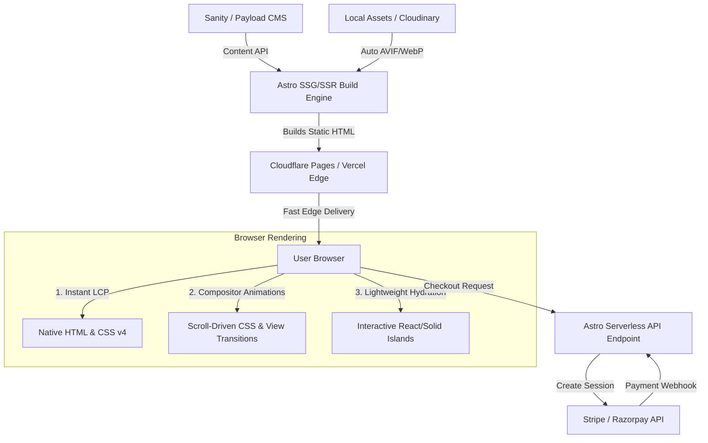

# SSDPA Durga Pujo 2026: Tech Stack & Architecture Plan

This document outlines the planned technology stack and architecture for the public-facing **Shriram Samruddhi Durga Pujo Association (SSDPA) 2026** website. 

The goal is to build a **media-heavy, animation-rich** website that is **responsive** and **extremely fast** (optimizing for Core Web Vitals, particularly LCP and INP), with support for a **headless CMS** and **payment gateway integrations** in the future.

---

## Summary of the Recommended Stack

| Component | Technology | Rationale |
| :--- | :--- | :--- |
| **Frontend Framework** | [Astro](https://astro.build/) (Hybrid SSR) | Compiles to zero-JS static HTML by default. Hydrates only dynamic interactive blocks (Islands). Crucial for fast page loads (LCP) and unblocking the main thread (INP). |
| **Styling & Layout** | [Tailwind CSS v4](https://tailwindcss.com/) | Blazing-fast Rust-based compilation engine. Supports modern CSS features (native variables, container queries, `:has()`) natively. |
| **Animations** | Native CSS Scroll-Driven Animations & View Transitions | Tie animations (parallax, fade-ins, headers) directly to scroll positions natively. Runs on the GPU compositor thread instead of blocking the JS main thread. |
| **Media Delivery** | AVIF / WebP + Adaptive Streaming (Mux/Cloudflare) | Native Astro image optimization pipeline combined with HLS adaptive bitrate streaming for video. |
| **Headless CMS** | Sanity.io or Payload CMS | API-driven content management. Keeps code decoupled from editor updates. |
| **Payments** | Stripe or Razorpay | Redirect checkouts driven secure serverless API endpoints. |

---

## 1. Core Architecture: Astro

Astro is chosen as the foundational meta-framework for this project due to its content-focused design.

*   **Zero JS by Default:** Public informational pages, event schedules, sponsor banners, and history sections render to pure HTML at build time, resulting in instantaneous visual load and no layout shifts.
*   **Island Hydration:** If a component needs to be dynamic (e.g., a ticket booking drawer or interactive search), we can write it in React, Vue, Svelte, or Solid, and hydrate only that element using directives like `<TicketButton client:visible />`.
*   **Built-in View Transitions:** Astro includes native integration with the browser's **View Transitions API**, allowing pages to morph and animate smoothly into one another during navigation (simulating a Single Page Application experience natively).
*   **Hybrid Rendering:** Most of the site is generated statically (SSG) for speed, while pages containing dynamic operations (such as processing payments or verifying tickets) leverage Server-Side Rendering (SSR).

---

## 2. Animation Pipeline

To keep the site highly interactive without sacrificing performance:

*   **Native Scroll-Driven Animations:** Avoid loading heavy JS scroll runner libraries (like GSAP or ScrollMagic). Use standard CSS rules:
    ```css
    @keyframes fade-in-up {
      from { opacity: 0; transform: translateY(20px); }
      to { opacity: 1; transform: translateY(0); }
    }
    
    .scroll-fade-element {
      animation: fade-in-up linear both;
      animation-timeline: view();
      animation-range: entry 20% cover 40%;
    }
    ```
    This shifts layout and animation workload entirely onto the browser's compositor thread, bypassing the JavaScript runtime.
*   **View Transitions:** Smoothly morph matching elements (like a thumbnail expanding into a detailed modal) using the native `view-transition-name` CSS property.

---

## 3. Media Optimization

Because the SSDPA website is media-heavy (rich pandal photos, high-resolution imagery, sponsor logos, and highlight videos):

*   **Format Negotiation:** All images must be served in **AVIF** (preferred) or **WebP** formats, with automatic viewport size generation (`srcset`).
*   **LCP vs Lazy Loading:**
    *   **Hero banners / LCP targets:** Use `loading="eager" fetchpriority="high" decoding="sync"`.
    *   **Galleries / Below-the-fold content:** Always use native lazy loading (`loading="lazy"`).
*   **Video Delivery:** Highlight reels and cultural programme videos should use **adaptive bitrate streaming (HLS/DASH)** using a service like **Mux** or **Cloudflare Stream** to prevent page stuttering on spotty mobile data networks.

---

## 4. Future Integrations

### Headless CMS
*   **Sanity.io:** Hosted, structured content platform with real-time editorial updates.
*   **Payload CMS:** TypeScript-native, open-source CMS. Great if we want full database control (Postgres/MongoDB) hosted on the same server/serverless container.

### Payment Gateway
*   **Stripe / Razorpay Integration:**
    *   Payment requests will be triggered via server-side Astro endpoints (`src/pages/api/checkout.ts`).
    *   A secure redirect flow will send the user to the gateway host to complete transactions.
    *   Webhooks will handle processing successful transactions securely to register tickets, coupons, or donations.

---

## Architecture Flow


